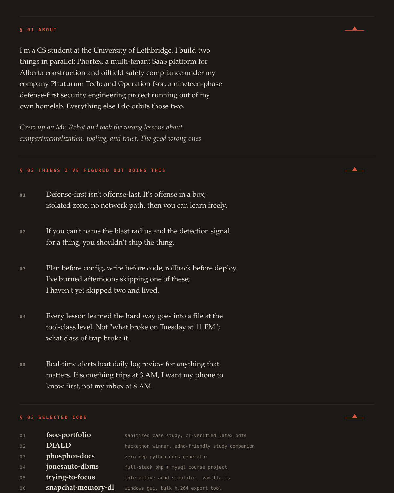
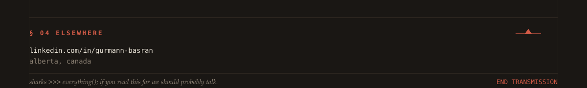

<picture>
  <source media="(prefers-color-scheme: dark)" srcset="svg/hero-dark.svg">
  <source media="(prefers-color-scheme: light)" srcset="svg/hero-light.svg">
  
</picture>

<picture>
  <source media="(prefers-color-scheme: dark)" srcset="svg/body-dark.svg">
  <source media="(prefers-color-scheme: light)" srcset="svg/body-light.svg">
  
</picture>

<picture>
  <source media="(prefers-color-scheme: dark)" srcset="svg/footer-dark.svg">
  <source media="(prefers-color-scheme: light)" srcset="svg/footer-light.svg">
  
</picture>

<!--
  links (for click-through, since SVG-as-image isn't clickable on github):
  fsoc-portfolio      github.com/gbasran/fsoc-portfolio
  DIALD               github.com/gbasran/DIALD
  phosphor-docs       github.com/gbasran/phosphor-docs
  jonesauto-dbms      github.com/gbasran/jonesauto-dbms
  trying-to-focus     github.com/gbasran/trying-to-focus
  snapchat-memory-dl  github.com/gbasran/Snapchat-Memory-Downloader
  linkedin            linkedin.com/in/gurmann-basran
-->

[fsoc-portfolio](https://github.com/gbasran/fsoc-portfolio)  ·  [DIALD](https://github.com/gbasran/DIALD)  ·  [phosphor-docs](https://github.com/gbasran/phosphor-docs)  ·  [jonesauto-dbms](https://github.com/gbasran/jonesauto-dbms)  ·  [trying-to-focus](https://github.com/gbasran/trying-to-focus)  ·  [snapchat-memory-dl](https://github.com/gbasran/Snapchat-Memory-Downloader)  ·  [linkedin](https://www.linkedin.com/in/gurmann-basran/)

