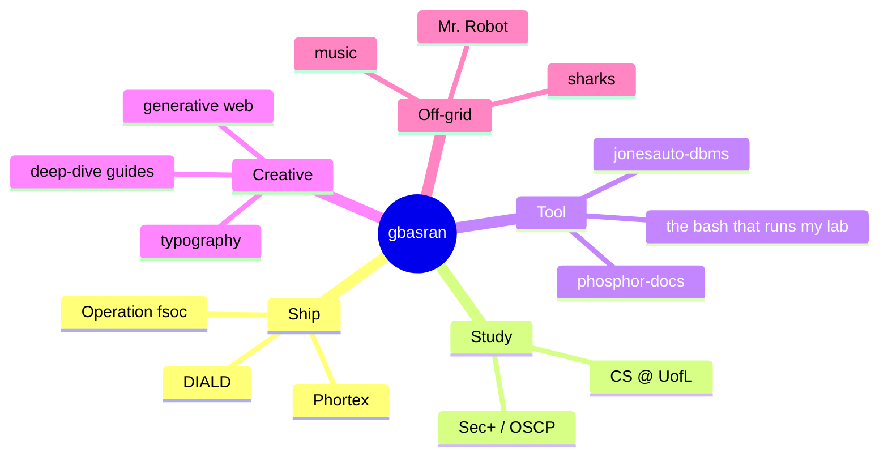

```
╔═══════════════════════════════════════════════════════════╗
║  fsoc://  gurmann basran                                  ║
║  cs @ uleth  ·  founder @ phuturum tech  ·  sharks > all  ║
╚═══════════════════════════════════════════════════════════╝
```

I build defensive security infrastructure and multi-tenant SaaS. Grew up on Mr. Robot and took the wrong lessons about compartmentalization, tooling, and trust. The good wrong ones.

---

## Active

<table>
<tr>
<td width="33%" align="center" valign="top">

**🛡️  Operation fsoc**

19-phase defense-first security engineering project.

[sanitized case study](https://github.com/gbasran/fsoc-portfolio)

</td>
<td width="33%" align="center" valign="top">

**🏗️  Phortex**

Multi-tenant SaaS for Alberta construction and oilfield safety compliance.

.NET 8 · PostgreSQL · Blazor

</td>
<td width="33%" align="center" valign="top">

**📚  Sec+ → OSCP**

On the roadmap. Phases 4 through 10 of fsoc do the work.

</td>
</tr>
</table>

---

## Stack

```bash
$ whoami --stack

  backend    c#, .net 8, postgresql, ef core, clean architecture
  frontend   typescript, next.js, react, blazor, tailwind, figma
  infra      linux, docker, bash, cloud
  security   firewalls, ids/siem, vpn, threat modeling
  writing    latex, markdown, academic reports
  sharks     many
```

---

## Neighborhood



---

## Currently

```txt
[2026-04]  shipping   →  Operation fsoc sanitized case study
[2026-04]  studying   →  threat modeling, detection engineering
[2026-04]  tinkering  →  multi-zone inter-policy design
[2026-04]  rewatching →  Mr. Robot, season 3
```

---

## Find me

- 💼 [linkedin.com/in/gurmann-basran](https://linkedin.com/in/gurmann-basran)
- 📍 Lethbridge + Calgary, Alberta, Canada

---

<sub>🦈 sharks >>> everything();  ·  if you read this far you probably like sharks too. say hi.</sub>
