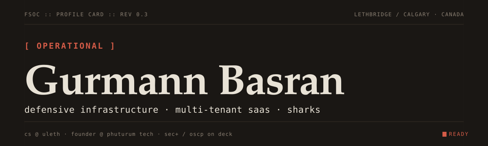

<picture>
  <source media="(prefers-color-scheme: dark)" srcset="svg/hero-dark.svg">
  <source media="(prefers-color-scheme: light)" srcset="svg/hero-light.svg">
  
</picture>

&nbsp;

I'm a CS student at the University of Lethbridge building two things in parallel: [Phortex](https://github.com/gbasran), a multi-tenant SaaS platform for Alberta construction and oilfield safety compliance that I'm building under the company I run, Phuturum Tech; and [Operation fsoc](https://github.com/gbasran/fsoc-portfolio), a nineteen-phase defense-first security engineering project running out of my own homelab. Security+ and OSCP are on the roadmap. Everything else I do (typography labs, deep-dive study guides, generative web, the hackathon win) orbits those two.

Grew up on Mr. Robot and took the wrong lessons about compartmentalization, tooling, and trust. The good wrong ones.

### things i've figured out doing this

- Defense-first isn't offense-last. It's offense in a box; isolated zone, no network path, then you can learn freely without anything of yours on the line.
- If you can't name the blast radius and the detection signal for a thing, you shouldn't ship the thing.
- Plan before config, write before code, rollback before deploy. I've burned afternoons skipping one of these; I haven't yet skipped two and lived.
- Every lesson learned the hard way goes into a file at the tool-class level. Not "what broke on Tuesday at 11 PM"; what class of trap broke it.
- Real-time alerts beat daily log review for anything that actually matters. If something trips at 3 AM, I want my phone to know first, not my inbox at 8 AM.

### selected code

[**fsoc-portfolio**](https://github.com/gbasran/fsoc-portfolio)  ·  sanitized case study of Operation fsoc. Six LaTeX-sourced PDFs compiled by a GitHub Actions workflow, plus a `make check` target that fails the build if a product name or em-dash leaks into the tex.

[**DIALD**](https://github.com/gbasran/DIALD)  ·  hackathon winner. An ADHD-friendly study companion that tells you what to do next instead of giving you more things to manage.

[**phosphor-docs**](https://github.com/gbasran/phosphor-docs)  ·  zero-dependency Python docs generator. YAML theming, built-in search, AI-authoring support.

[**jonesauto-dbms**](https://github.com/gbasran/jonesauto-dbms)  ·  full-stack PHP + MySQL system for a used-car dealership. CPSC 3660 course project shipped with a LaTeX design report.

[**trying-to-focus**](https://github.com/gbasran/trying-to-focus)  ·  interactive ADHD simulator. CSS + vanilla JS, zero frameworks.

[**Snapchat-Memory-Downloader**](https://github.com/gbasran/Snapchat-Memory-Downloader)  ·  Windows GUI that bulk-pulls the Snapchat Memories export into H.264 MP4.

### find me

[linkedin.com/in/gurmann-basran](https://www.linkedin.com/in/gurmann-basran/)  ·  Lethbridge + Calgary, AB, Canada

&nbsp;

🦈  sharks >>> everything();  ·  if you read this far we should probably talk.
